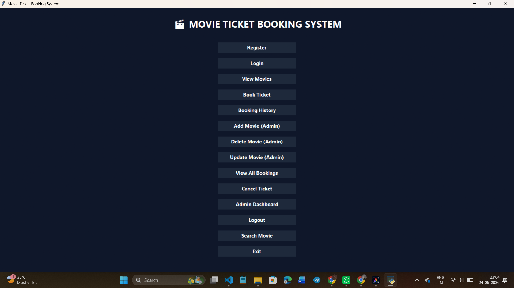
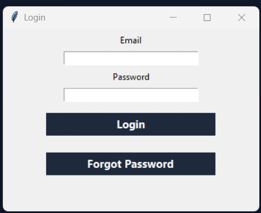
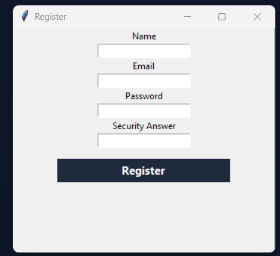
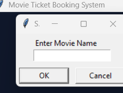

# 🎬 Movie Ticket Booking System

A desktop-based Movie Ticket Booking System developed using **Python**, **Tkinter**, and **MySQL**. This application allows users to register, login, search movies, book tickets, view booking history, cancel bookings, and receive ticket confirmations.

## 📌 Features

- User Registration
- User Login Authentication
- View Available Movies
- Search Movies
- Book Movie Tickets
- View Booking History
- Cancel Bookings
- Email Ticket Confirmation
- Database Integration using MySQL
- GUI Interface using Tkinter

---

## 🛠 Technologies Used

- Python 3.9
- Tkinter
- MySQL
- mysql-connector-python
- SMTP Email Service

---

## 📂 Project Structure

```
MovieTicketBooking/
│
├── main.py
├── current_gui.py
├── booking.py
├── database.py
├── email_sender.py
├── email_ticket.py
├── movie_ticket.py
├── movie_booking.sql
├── requirements.txt
├── screenshots/
│   ├── homepage.png
│   ├── login.png
│   ├── register.png
│   ├── book tickets.png
│   └── booking_history.png
└── README.md
```

---

## ⚙️ Installation

### Clone Repository

```bash
git clone https://github.com/ramyasreedegala2024/MovieTicketBooking.git
cd MovieTicketBooking
```

### Install Dependencies

```bash
pip install -r requirements.txt
```

### Setup Database

1. Open MySQL.
2. Create a database.
3. Import the SQL file:

```sql
source movie_booking.sql
```

### Run Application

```bash
python current_gui.py
```

---

## 🖼 Screenshots

### Homepage



### Login



### Register



### Book Tickets


### Booking History



---

## 🎯 Project Functionalities

- User authentication system
- Movie search functionality
- Ticket booking and cancellation
- Booking history management
- Email ticket confirmation
- MySQL database operations
- Interactive graphical user interface

---

## 🚀 Future Enhancements

- Online payment integration
- Admin dashboard
- Seat selection interface
- Movie posters and trailers
- QR code ticket generation
- Cloud database deployment

---

## 👩‍💻 Author

**Ramya Sree Degala**

GitHub:
https://github.com/ramyasreedegala2024
