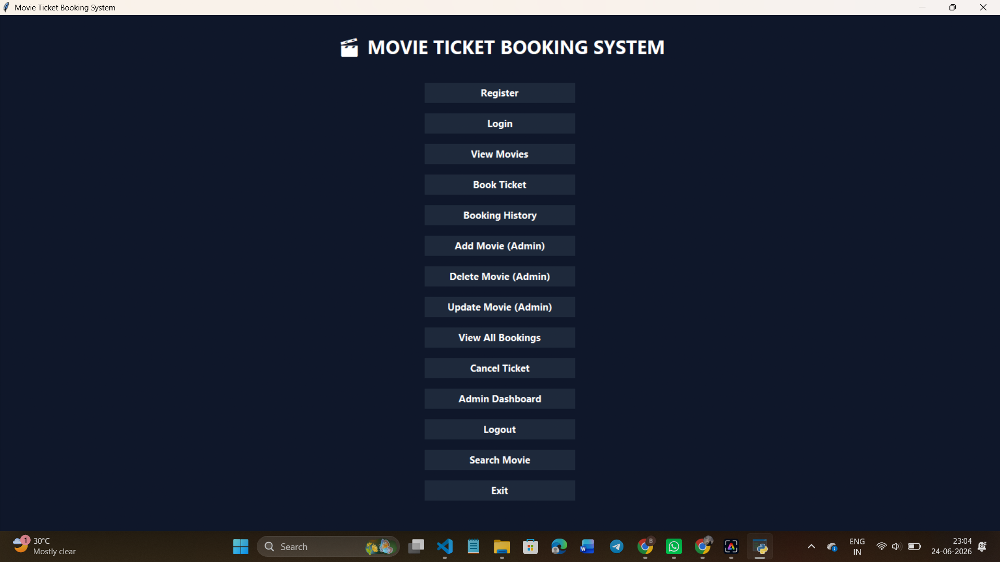

# 🎬 Movie Ticket Booking System

A desktop-based **Movie Ticket Booking System** developed using **Python (Tkinter)** and **MySQL**. This application allows users to register, log in, browse movies, book tickets, cancel bookings, and view booking history. It also includes an **Admin Panel** for managing movies and monitoring bookings.

---

## 🚀 Features

### 👤 User Features
- User Registration
- Secure Login
- Forgot Password (Security Answer)
- View Available Movies
- Search Movies
- Book Movie Tickets
- Cancel Bookings
- Booking History
- Logout

### 👨‍💼 Admin Features
- Admin Login
- Add Movies
- Update Movies
- Delete Movies
- View All Bookings
- Admin Dashboard (Users, Movies & Bookings Count)

### 📧 Additional Features
- Email Ticket Confirmation
- PDF Ticket Generation
- MySQL Database Integration
- Tkinter GUI

---

## 🛠️ Technologies Used

- Python 3
- Tkinter
- MySQL
- mysql-connector-python
- ReportLab
- SMTP (Email)
- Git & GitHub

---

## 📂 Project Structure

```
MovieTicketBooking/
│
├── current_gui.py
├── database.py
├── booking.py
├── movies.py
├── movie_ticket.py
├── email_sender.py
├── email_ticket.py
├── pdf_ticket.py
├── user.py
├── movie_booking.sql
├── requirements.txt
├── screenshots/
└── README.md
```

---

## ⚙️ Installation

### Clone Repository

```bash
git clone https://github.com/ramyasreedegala2024/MovieTicketBooking.git
```

### Move into Project

```bash
cd MovieTicketBooking
```

### Install Requirements

```bash
pip install -r requirements.txt
```

### Import Database

Open MySQL and run:

```sql
SOURCE movie_booking.sql;
```

### Run Project

```bash
python current_gui.py
```

---

# 📸 Screenshots

## Home Page



---

## Login


---

## Register


---

## Book Ticket


---

## Booking History


---

## 📌 Future Improvements

- Online Payment Integration
- Seat Layout Selection
- QR Code Ticket
- Movie Posters
- Email OTP Verification
- Password Encryption
- Responsive UI

---

## 👩‍💻 Author

**Ramya Sree Degala**

GitHub:
https://github.com/ramyasreedegala2024

---

## ⭐ If you like this project

Please give this repository a **Star ⭐**.
